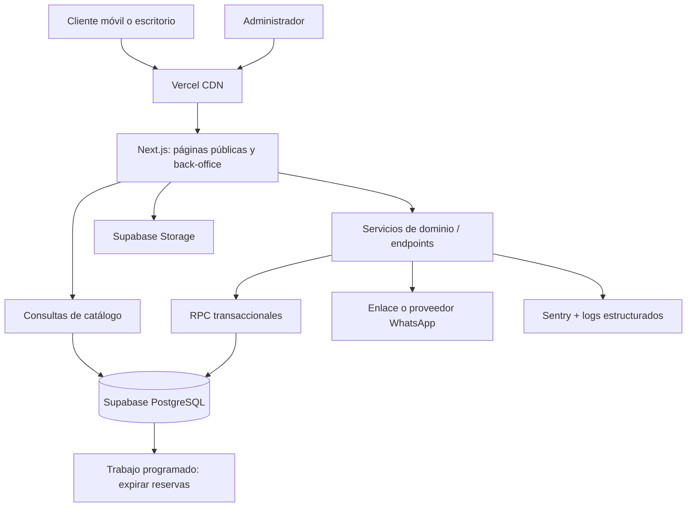
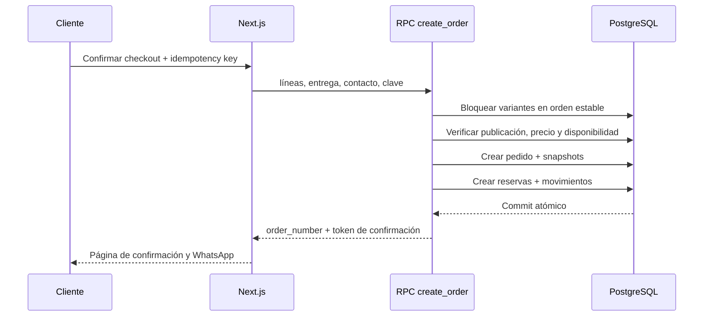

# Plan técnico optimizado — Tienda Geek escalable

**Versión:** 2.0  
**Estado:** propuesta de arquitectura y ejecución  
**Mercado inicial:** Perú  
**Objetivo de negocio:** publicar una tienda móvil, rápida y confiable que convierta tráfico social en pedidos reales, sin comprometer la exactitud del inventario ni requerir una reescritura al crecer.

> Este documento sustituye el enfoque de “construir todos los módulos” por un **monolito modular, API transaccional y entregas verticales**. Mantiene Supabase como plataforma operativa, pero reemplaza el SPA de Vite por renderizado híbrido para SEO y rendimiento comercial.

## 1. Decisiones de arquitectura

| Decisión | Elección | Razón |
| --- | --- | --- |
| Aplicación | Next.js + TypeScript (App Router) | Renderizado de catálogo/producto en servidor, SEO, caché y rutas públicas rápidas. |
| Estilos y componentes | Tailwind CSS + componentes accesibles propios | Consistencia visual sin acoplar el dominio a una librería de UI. |
| Datos, auth y media | Supabase: PostgreSQL, Auth, Storage, funciones SQL/RPC | Reduce operación y ofrece PostgreSQL transaccional con RLS. |
| Operaciones críticas | RPC/funciones SQL invocadas solo desde servidor | Stock, precios y pedidos no dependen del navegador ni de múltiples llamadas. |
| Hosting | Vercel + Supabase en región cercana disponible | CDN, previews por PR y despliegue administrado. |
| Arquitectura | Monolito modular; no microservicios | Menor coste y complejidad. Las fronteras del dominio permiten extraer servicios si el volumen lo exige. |
| Pagos iniciales | Pedido con reserva temporal + confirmación manual | Compatible con Yape/Plin/transferencia; evita sobreventa. |
| Búsqueda | PostgreSQL full-text + trigram | Suficiente para el catálogo inicial; se cambia a un motor externo solo con evidencia. |
| Observabilidad | Logs estructurados, Sentry, analítica de eventos | Detecta errores de compra y permite priorizar mejoras por conversión. |

### 1.1 Principios no negociables

- El cliente nunca escribe directamente `orders`, `order_items`, precios, pagos ni stock.
- Cada modificación de inventario se registra como un movimiento inmutable y trazable.
- El checkout es atómico, idempotente y valida en servidor precio, estado de producto y disponibilidad.
- El catálogo público solo expone una proyección segura de productos publicados.
- Las reglas de negocio viven cerca de la base de datos o del servicio de dominio, no repartidas entre componentes React.
- Todo cambio se prueba en preview antes de producción; las migraciones son versionadas y reversibles cuando sea viable.

## 2. Alcance por releases

El MVP se limita a la ruta que produce pedidos administrables. Un módulo solo entra si elimina una fricción de compra o una operación manual diaria relevante.

### Release 0 — Base operable

- Identidad mínima, 20–50 productos reales y reglas comerciales cerradas.
- Infraestructura, CI, entornos, migraciones, roles, Storage y datos semilla.
- Design tokens, layout responsive y páginas legales mínimas.

**Salida:** se puede cargar y publicar un producto de prueba de forma segura.

### Release 1 — MVP comercial

- Home orientada a conversión, catálogo paginado, categorías, franquicias y búsqueda.
- Ficha SEO de producto, imágenes, precio, disponibilidad y preventa.
- Carrito anónimo persistente y checkout como invitado.
- Pedido con reserva de inventario, comprobación manual de pago y enlace a WhatsApp posterior a la creación.
- Back-office mínimo: productos, imágenes, inventario, pedidos y cambios de estado.
- SEO técnico, analítica de embudo, monitoreo de errores y compra de prueba.

**No entra:** dashboard financiero, cupones, cuentas de cliente, banners administrables, recomendaciones, reportes avanzados, envío calculado en tiempo real ni aplicación móvil.

**Criterio de salida:** un cliente puede completar un pedido y el equipo puede confirmarlo, prepararlo, despacharlo, cancelarlo y auditar su inventario sin SQL manual.

### Release 1.1 — Eficiencia operativa

- Importación/exportación CSV con validación y vista previa.
- Historial de estados, vencimiento automático de reservas y alertas de stock bajo.
- Notificaciones transaccionales (correo/WhatsApp mediante proveedor aprobado).
- Cupones simples con reglas explícitas y eventos de analítica enriquecidos.

### Release 1.2 — Cobro automatizado

- Pasarela compatible con Perú, intentos de pago, webhooks firmados e idempotentes.
- Confirmación automática, conciliación y reembolsos según política.
- Recuperación de carrito solo cuando exista consentimiento y canal de contacto válido.

### Release 2 — Escalar con evidencia

- Cuentas, favoritos y direcciones; facturación; multialmacén; operadores logísticos; BI.
- Extraer búsqueda, notificaciones o fulfillment únicamente si métricas, SLA o carga justifican hacerlo.

## 3. Métricas y límites de éxito

| Área | Métrica inicial | Meta/alerta |
| --- | --- | --- |
| Conversión | `view_product → add_to_cart → order_created` | Medir desde el día 1; optimizar el mayor abandono. |
| Inventario | Pedidos confirmados con stock negativo | 0. Incidente P0 si ocurre. |
| Fiabilidad | Error al crear pedido | < 1% de intentos; alerta al superar el umbral. |
| Rendimiento | Core Web Vitals de páginas públicas | LCP < 2.5 s p75, INP < 200 ms p75, CLS < 0.1. |
| Accesibilidad | Auditoría automatizada | Sin incidencias críticas; navegación completa por teclado. |
| Operación | Pedido hasta primer contacto | Objetivo comercial definido antes del lanzamiento. |

## 4. Arquitectura lógica



### 4.1 Módulos y dependencias

```text
src/
  app/                 # Rutas, layouts, Server Components y route handlers
  modules/
    catalog/           # Consultas públicas, filtros y proyección de producto
    product/           # Administración de producto, variante e imágenes
    cart/              # Estado cliente y sincronización de precios
    checkout/          # DTO, validación, creación idempotente de pedido
    inventory/         # Movimientos, disponibilidad y reservas
    orders/            # Transiciones de pedido, pagos y fulfillment
    identity/          # Roles, autorización y sesión de back-office
    content/           # Home, categorías, franquicias y campañas posteriores
  shared/
    ui/ lib/ validation/ config/ types/
supabase/
  migrations/          # Fuente única del esquema y políticas
  seed.sql
  tests/               # Pruebas SQL/RPC críticas
```

Regla: un módulo no consulta tablas internas de otro módulo desde componentes. Expone funciones, tipos y contratos explícitos. Esto reduce acoplamiento y hace viable mover una capacidad más adelante.

### 4.2 Estrategia de renderizado y caché

- Home, categoría, franquicia y producto: renderizado en servidor con revalidación por etiquetas al publicar/editar.
- Búsqueda y filtros: parámetros en URL, consulta paginada y `no-store` solo donde la frescura sea necesaria.
- Admin y checkout: dinámicos; sin caché de información sensible o de stock.
- Imágenes: CDN, tamaños derivados, WebP/AVIF cuando sea posible, `width`/`height` definidos y carga diferida fuera del primer viewport.
- Invalidación: una mutación de producto invalida sus etiquetas, la categoría/franquicia afectada y home si corresponde; no se purga el sitio completo.

## 5. Modelo de dominio y datos

### 5.1 Ajustes esenciales al modelo original

- **Variantes primero:** un producto puede tener variantes (edición, talla, color, volumen, condición). SKU, precio y stock pertenecen a la variante; para un artículo simple se crea una única variante `default`.
- **Inventario derivado:** no se actualiza un `products.stock` como fuente de verdad. La disponibilidad se calcula o mantiene en `inventory_items` a partir de movimientos/reservas con bloqueo transaccional.
- **Relaciones flexibles:** producto–categoría y producto–franquicia son many-to-many, con una categoría/franquicia principal opcional para SEO y navegación.
- **Snapshots inmutables:** `order_items` conserva nombre, SKU, precio, descuento e impuestos/envío aplicados al momento del pedido, aunque cambie el catálogo.
- **Dinero como enteros:** guardar importes en céntimos (`integer`/`bigint`) y moneda ISO `PEN`; elimina errores de redondeo.
- **Estados controlados:** usar `enum` o tablas de transición, `check constraints` y fechas de auditoría; nunca texto libre para estados operativos.

### 5.2 Tablas mínimas

| Dominio | Tablas | Nota |
| --- | --- | --- |
| Catálogo | `products`, `product_variants`, `product_images`, `categories`, `product_categories`, `franchises`, `product_franchises`, `brands` | `products` contiene estado editorial; la variante contiene SKU y venta. |
| Inventario | `inventory_items`, `inventory_movements`, `inventory_reservations` | Ledger inmutable y reserva con vencimiento. |
| Pedidos | `customers`, `customer_addresses`, `orders`, `order_items`, `order_status_history`, `payment_attempts` | La dirección se copia como snapshot en pedido. |
| Operación | `profiles`, `user_roles`, `idempotency_keys`, `audit_log`, `store_settings` | Roles y mutaciones críticas auditables. |
| Contenido | `banners` o CMS posterior | No bloquea el MVP. |

### 5.3 Índices obligatorios

- `product_variants(sku)` único y parcial para variantes activas si se requiere reutilización histórica.
- `products(slug)` único, `products(status, published_at desc)` para catálogo.
- Tablas puente por ambos sentidos: `(product_id, category_id)` y `(category_id, product_id)`; equivalente para franquicias.
- `product_images(product_id, sort_order)`.
- `orders(order_number)` único, `(status, created_at desc)`, `(customer_phone, created_at desc)`.
- `inventory_reservations(variant_id, expires_at)` parcial para reservas activas.
- Búsqueda con índice GIN sobre documento de texto normalizado; `pg_trgm` para coincidencias parciales.

Antes de añadir un índice, ejecutar `EXPLAIN ANALYZE` contra datos de volumen representativo. No indexar por intuición.

## 6. Inventario y checkout: flujo transaccional

La fuente de verdad de la venta es una única operación `create_order`, expuesta por RPC o función de servidor autenticada. No se encadena desde el navegador.



### 6.1 Reglas operativas

1. El servidor recalcula todos los importes; el total enviado por el cliente es informativo y nunca persiste sin validación.
2. Las variantes se bloquean con `SELECT ... FOR UPDATE` en un orden determinista para evitar condiciones de carrera y reducir bloqueos cruzados.
3. Una reserva vence, por defecto, en 30 minutos. Un job la libera de forma idempotente y crea el movimiento correspondiente.
4. El mismo `idempotency_key` y cliente/huella de sesión devuelve el mismo pedido, no descuenta stock dos veces.
5. Confirmar un pago mueve la reserva a venta; cancelar o expirar la libera. Ninguna transición puede ejecutarse dos veces.
6. Las preventas tienen cupo/reserva independiente o inventario previsto; nunca se mezclan accidentalmente con stock físico.
7. El pedido por WhatsApp es un paso posterior a la persistencia; si la app externa no abre, el pedido sigue visible y recuperable por el negocio.

### 6.2 Máquina de estados

```text
order: draft → pending_payment → paid → preparing → shipped → delivered
                         └──→ cancelled / expired

payment: pending → submitted_for_review → confirmed
                  └──→ rejected / refunded

reservation: active → converted | released | expired
```

Las transiciones permitidas se implementan en una función de dominio que registra `order_status_history`, actor, fecha, razón y efectos de inventario.

## 7. Seguridad y privacidad

- Activar RLS en toda tabla expuesta. El público consume solo vistas o funciones `security invoker` que devuelven productos publicados.
- La clave `service_role` solo existe en funciones de servidor/CI; jamás bajo prefijo `NEXT_PUBLIC_` ni en el navegador.
- Roles (`admin`, `operator`) definidos con `user_roles`; las políticas no confían en metadatos modificables por cliente.
- Back-office con MFA para administradores cuando el canal esté disponible y sesiones con expiración razonable.
- Validar DTOs en servidor con Zod y reforzar invariantes con constraints SQL.
- Limitar por IP/huella los intentos de checkout, login y carga de archivos; usar CAPTCHA solo al detectar abuso para no degradar conversión.
- Storage privado para originales administrativos; URLs firmadas o imágenes públicas únicamente cuando sea intencional. Validar MIME, tamaño y dimensiones.
- Minimizar PII, cifrar secretos, definir retención de pedidos y acceso por necesidad. No incluir dirección o documento en eventos de analítica ni mensajes innecesarios.
- `audit_log` obligatorio para precio, producto, stock, pago, estado de pedido, usuario y configuración.
- Backups: verificar restauración trimestralmente. Un backup no probado no es un plan de recuperación.

## 8. Contratos de producto y APIs

### Endpoint/acción de lectura pública

- Solo devuelve `published` y variantes vendibles, con precio público, disponibilidad agregada y media optimizada.
- Los filtros se permiten por una lista blanca y se limitan en tamaño; `page` basada en cursor para catálogos grandes.

### Comando `create_order`

Entrada mínima: líneas `{variantId, quantity}`, datos de contacto/entrega, método de pago, versión de precios y `idempotencyKey`.

Salida: `orderId`, `orderNumber`, estado, importes recalculados, vencimiento de reserva y URL/mensaje de WhatsApp generado desde datos persistidos.

Errores de dominio explícitos: `out_of_stock`, `price_changed`, `product_unavailable`, `reservation_conflict`, `invalid_delivery`, `duplicate_request`. Cada error tiene código estable, mensaje seguro y correlación en logs.

## 9. Back-office diseñado para la operación real

El panel inicial no es un dashboard de vanidad. Prioridad:

1. Bandeja de pedidos con filtros por estado, fecha, pago y vencimiento de reserva.
2. Detalle de pedido con historial, evidencia/nota de pago y acción de transición autorizada.
3. CRUD de producto/variante con borrador, publicación, imágenes y validación de SKU.
4. Ajuste de inventario con motivo obligatorio; no existe “editar stock” silenciosamente.
5. Alertas operativas: reservas próximas a vencer, sin stock y stock bajo.

Los reportes y campañas visuales se agregan después de que el flujo de pedidos esté estable.

## 10. Calidad, entrega y operación

### 10.1 Pirámide de pruebas

- Unitarias: dinero, descuentos, estados, transformadores, mensajes y validaciones.
- Integración PostgreSQL/RPC: concurrencia de última unidad, doble envío idempotente, cancelación, expiración, RLS y snapshots.
- E2E en preview: descubrir, filtrar, carrito, checkout, confirmación, administración de pedido y restauración de inventario.
- Smoke post-despliegue: home, catálogo, una ficha, login admin y creación de pedido controlado.

Los casos de concurrencia e idempotencia son obligatorios antes de recibir tráfico pagado.

### 10.2 CI/CD

En cada PR: typecheck, lint, pruebas unitarias, migraciones en base efímera o staging, pruebas de políticas y E2E críticos.  
En `main`: preview verificable y promoción controlada a producción. Las migraciones se aplican antes de activar código que las consume y se monitorean después.

### 10.3 Entornos

| Entorno | Datos | Uso |
| --- | --- | --- |
| Local | Semillas sintéticas | Desarrollo y pruebas rápidas. |
| Staging/preview | Anonimizados o sintéticos | Validación de PR y pruebas de aceptación. |
| Producción | Reales | Operación; acceso mínimo y auditoría. |

Nunca reutilizar el proyecto Supabase de producción para desarrollo ni exponer claves entre entornos.

### 10.4 Observabilidad y respuesta

- Logs JSON con `request_id`, `order_id`, actor y código de error, sin PII sensible.
- Sentry para errores de cliente/servidor y alertas de checkout.
- Dashboard operativo: creación de pedidos, ratio de errores, pedidos pendientes/vencidos, stock bajo y latencia RPC.
- Runbooks de una página para: stock negativo, pedido duplicado, pago no confirmado, fallo de despliegue y restauración de datos.

## 11. SEO, accesibilidad y rendimiento

- Metadatos únicos, canonical, sitemap dinámico, `robots.txt`, Open Graph y JSON-LD de `Product`, `Offer`, `BreadcrumbList` y `Organization` donde corresponda.
- Productos agotados siguen indexables si son relevantes; no permiten compra. Los productos retirados aplican 301 a un sustituto real o 410, nunca redirección genérica.
- La URL conserva filtros indexables seleccionados; combinaciones de bajo valor reciben `noindex,follow` para evitar páginas duplicadas.
- WCAG 2.2 AA como referencia: foco visible, contraste, labels, mensajes de error accesibles, navegación por teclado y objetivos táctiles adecuados.
- Presupuesto inicial: JavaScript mínimo en páginas públicas, imagen hero optimizada, fuentes con `display: swap`, sin widgets de terceros antes del consentimiento y necesidad demostrada.

## 12. Analítica orientada a decisiones

Eventos: `view_item_list`, `view_item`, `search`, `add_to_cart`, `remove_from_cart`, `begin_checkout`, `order_created`, `open_whatsapp`, `payment_confirmed`, `order_cancelled`.

Propiedades seguras: origen/campaña, categoría, franquicia, SKU anonimizado si corresponde, precio en rango y estado de disponibilidad. Nunca teléfono, dirección, correo ni documento.

Revisión semanal: búsquedas sin resultado, abandono por paso, productos vistos/vendidos, tasa de pago confirmado, tiempo de reserva y causas de cancelación. Cada release debe asociarse a una hipótesis y una métrica.

## 13. Plan de ejecución: 6 semanas + estabilización

| Semana | Entrega vertical | Condición para avanzar |
| --- | --- | --- |
| 0 | Decisiones comerciales: catálogo, stock, fotos, entregas, política de reserva, responsables y KPI base | Datos de 20 productos listos y reglas aprobadas. |
| 1 | Repositorio, Next.js, Supabase, migraciones, RLS, CI, preview, design tokens y seeds | Un producto de prueba publicado y visible solo mediante proyección pública. |
| 2 | Catálogo, búsqueda, filtros, ficha, media y SEO técnico | Lighthouse y pruebas de navegación en móvil aprobados. |
| 3 | Carrito y RPC transaccional: variantes, movimientos, reservas, expiración e idempotencia | Pruebas de última unidad y doble clic pasan. |
| 4 | Checkout invitado, confirmación, WhatsApp, pedidos y panel de operación | Un pedido de punta a punta puede auditarse y cancelarse. |
| 5 | Publicación/admin de producto, imágenes, stock bajo, analítica, legal, seguridad y accesibilidad | Ensayo de carga de catálogo y operación diaria completado. |
| 6 | E2E, prueba de compra real, rendimiento, runbooks, backup/restore y lanzamiento gradual | Checklist de go-live firmado por negocio y tecnología. |
| 7–8 | Hipercuidado: observación diaria, correcciones P0/P1 y priorización mediante métricas | Primera retrospectiva y backlog 1.1 basado en evidencia. |

## 14. Definition of Ready / Done

### Ready

Una historia puede empezar cuando tiene objetivo comercial, criterios de aceptación, diseño/estados vacíos y de error, reglas de autorización, eventos analíticos y dependencia de datos identificada.

### Done

- Código revisado, tipado, accesible y responsive.
- Validación en cliente y servidor; constraints/políticas de datos si afectan dominio.
- Pruebas proporcionales al riesgo y smoke test en preview.
- Observabilidad, documentación y migraciones actualizadas.
- Sin secretos ni PII en cliente, logs o analítica.
- Criterios de aceptación demostrados a negocio.

## 15. Riesgos prioritarios y mitigación

| Riesgo | Prevención | Detección / respuesta |
| --- | --- | --- |
| Sobreventa | Reserva transaccional, bloqueo de variante, expiración e idempotencia | Alerta de conflicto; auditoría y corrección desde movimientos. |
| Fraude o pedidos no pagados | Estado pendiente, reserva breve, confirmación manual y límites de abuso | Vencimiento automático, motivos de cancelación y listas de revisión. |
| Catálogo lento o incompleto | Plantilla de carga, imágenes procesadas e importación validada | Métricas de rendimiento y búsquedas sin resultado. |
| Dependencia de terceros | Contratos aislados para pago/WhatsApp/analítica | Degradación: pedido se conserva y se reintenta o coordina manualmente. |
| Error humano de operación | Estados permitidos, permisos mínimos y audit log | Historial y runbook de reversión mediante movimientos compensatorios. |
| Coste o límites de plataforma | Métricas de DB, Storage y egress; presupuesto/alertas | Optimizar caché/media antes de cambiar de plataforma. |
| Expansión de alcance | Backlog con hipótesis y corte de release | No entra una función sin dueño, métrica y criterio de salida. |

## 16. Checklist de lanzamiento

- [ ] Identidad, dominio, políticas, catálogo, precios, stock y responsables operativos confirmados.
- [ ] RLS, roles, buckets y secretos revisados; no hay `service_role` en el cliente.
- [ ] Migraciones aplicadas, backup ejecutado y restauración verificada.
- [ ] Flujos de creación, confirmación, vencimiento y cancelación de pedido probados con una última unidad.
- [ ] Compra real de prueba en móvil y escritorio; WhatsApp entrega el resumen correcto.
- [ ] Sitemap, robots, metadatos, analítica, alertas y páginas de error activos.
- [ ] Rendimiento y accesibilidad cumplen el presupuesto; imágenes optimizadas.
- [ ] Runbooks, contactos de soporte y ventana de hipercuidado definidos.

## 17. Decisiones diferidas que requieren evidencia

- Elegir pasarela de pago después de comparar cobertura, comisión, conciliación, webhooks y soporte local.
- Implementar motor de búsqueda externo cuando PostgreSQL no cumpla latencia/relevancia a escala real.
- Adoptar multi-almacén solo al tener más de una ubicación de cumplimiento activa.
- Crear aplicación móvil solo si la retención y frecuencia justifican mantener otro cliente.
- Extraer servicios solo cuando un módulo tenga necesidades claras de despliegue, escala o disponibilidad independientes.

## Resultado esperado

Al finalizar Release 1 la tienda podrá captar tráfico social, servir fichas indexables y veloces, aceptar pedidos anónimos sin sobreventa, reservar inventario de forma trazable y operar el ciclo completo del pedido. La plataforma queda preparada para pagos automáticos, crecimiento de catálogo y nuevas capacidades sin introducir microservicios o infraestructura prematura.
