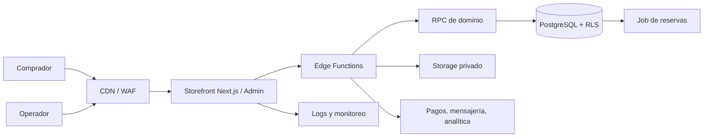

# HLD — Arquitectura general

## Decisión

Monolito modular con Supabase para datos, Auth, Storage y Edge Functions. El back-office Vite actual se conserva durante piloto; storefront público migra gradualmente a Next.js antes de beta abierta por SEO y dominio múltiple.

## Decisiones de frontera

- React no escribe precio, stock, pedido ni Storage directamente.
- Edge Functions validan HTTP; RPC y PostgreSQL preservan invariantes transaccionales.
- No usar microservicios, Redis o colas hasta que métricas de carga o latencia lo justifiquen.
- Pagos, notificaciones e IA se encapsulan detrás de adaptadores para poder cambiar proveedor.
