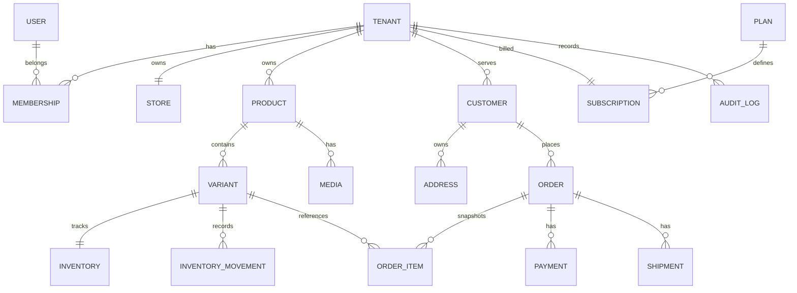

# ERD conceptual

Este es el modelo objetivo; las tablas de suscripción, tema, builder, pago y envío se crean solo al llegar a su épica. Las migraciones actuales están en `supabase/migrations` y siguen siendo la fuente física del esquema.

## Reglas físicas

- `tenant_id` obligatorio en entidades comerciales.
- Dinero en enteros y moneda ISO.
- Claves únicas por tenant para slug/SKU cuando corresponda.
- Índices basados en consultas reales y `EXPLAIN ANALYZE`.
- Migraciones versionadas, reversibles cuando sea viable y aplicadas al final del flujo de plataforma.
