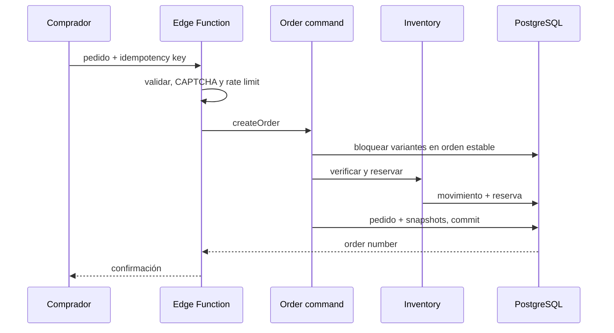

# LLD — Diseño por módulo

## Patrón obligatorio

Cada módulo expone contratos y mantiene sus detalles internos.

```text
module/
  api/          # DTOs y handlers
  application/  # casos de uso
  domain/       # entidades, value objects, reglas y eventos
  infrastructure/ # repositorios y proveedores
  policies/     # autorización
  tests/        # unitarias e integración
```

## Checkout e inventario



## Matriz de permisos

| Acción | Owner | Admin | Operator | Comprador |
| --- | --- | --- | --- | --- |
| Configurar tienda/miembros | Sí | Limitado | No | No |
| Crear/publicar producto | Sí | Sí | Sí | No |
| Ajustar inventario | Sí | Sí | Sí | No |
| Confirmar/cancelar pedido | Sí | Sí | Sí | No |
| Facturación y plan | Sí | No | No | No |
| Crear pedido público | No aplica | No aplica | No aplica | Sí |

Antes de implementar un módulo se debe agregar: caso de uso, DTO, política, pruebas, métricas y contrato API.
